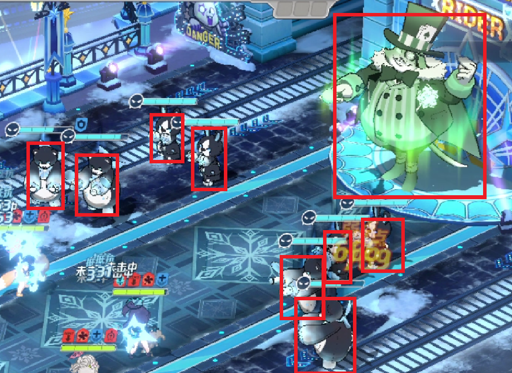

# 自动战斗(Auto Fight)

## 简介(Introduction)

本文档设计**BAAS**自动战斗的内容, 我们欢迎你在Issue中提出优化或新特性, 使自动战斗尽可能适用于各种场景

- 这里的自动战斗并非指使用游戏内的auto让角色盲目的释放技能, 而是指**BAAS**通过截取战斗时的图像并提取其中的信息, 根据一个确定流程在`恰当的条件`下释放技能
- 这个流程简称为`轴`
- 轴的运作理念类似于编译原理中的**有限状态自动机**
- 下图为一个简单的流程图
    

### 队伍配置
- 通过规定角色练度确定是否可以使用这个轴 (可选)
- 选择初始技能

### 可监测的条件
以下图为例介绍在自动战斗中图像中可被提取的信息
- 
1. BOSS的最大血量 / 总血量

2. 每个技能槽学生的技能以及技能Cost

3. 倍速 / 自动状态

4. 当前Cost

5. 战斗剩余时间

6. 房间剩余时间

7. 学生位置坐标及

8. 敌对角色的位置



## 状态(State)
每个状态由以下内容组成
1. action: 到达这个状态后执行的行为（如技能释放、开启auto/倍速等
2. transition: action结束后的状态转移列表
3. condition: 状态转移的条件
4. next_state: 下一个状态

**example**: 以上述内容书写一个简介中简单流程图的状态机
```json
{
  "states": {
    "start_state": {
      "next_state": "state_release_skill_1"
    },
    "state_release_skill_1": {
      "action": "release_skill_1",
      "transitions": [
        {
          "condition": "condition_boss_health_over_500w",
          "next_state": "state_release_skill_2"
        },
        {
          "condition": "condition_null",
          "next_state": "state_release_skill_2"
        }
      ]
    },
    "state_release_skill_2": {
      "action": "release_skill_2",
      "transitions": [
        {
          "condition": "condition_boss_health_over_0",
          "next_state": "state_restart"
        },
        {
          "condition": "condition_null",
          "next_state": "state_end"
        }
      ]
    },
    "state_restart": {
      "action": "restart",
      "transitions": [
        {
          "condition": "condition_null",
          "next_state": "start_state"
        }
      ]
    },
    "state_end": {
      "description": "This is end of script."
    }
  },
  "conditions": {
    "condition_null": {
      
    },
    
    "condition_boss_health_over_500w": {
      "condition": "Boss health > 5_000_000"
    },
    
    "condition_boss_health_over_0": {
      "condition": "Boss health > 0"
    }
  },
  "actions": {
    "release_skill_1": {
      "release_method": 1,
      "slot": {
        "number": 1
      },
      "target": {
        "position": [1180, 360],
        "name": "goz"
      },
      "check": {
        "type": 0
      }
    },
    "release_skill_2": {
      "release_method": 1,
      "slot": {
        "number": 1
      },
      "target": {
        "position": [1180, 360],
        "name": "goz"
      },
      "check": {
        "type": 0
      }
    },
    "restart": {
      "description": "Restart The Game"
    }
  }
  
}

```


## Action

释放技能有关的参数

### release_method

- **description**: 释放一个技能的方式
- **type**: `int`
- **constrains**:
-
    | 值   | 含义                       |
    |-----|--------------------------|
    | `0` | 开启`auto`释放 (确保`auto`被选中) |
    | `1` | 自定义点击顺序                  |
    | `2` | 保证槽技能被选中-->释放            |

**note**:
方式 `2, 3` 需要设置[`target`](#target) 

### target

#### type
- **description**: 技能释放的目标类型
- **type**: `int`
- **constrains**:
- 
    | 值   | 含义           | 需要字段       |
    |-----|--------------|------------|
    | `0` | 一个固定坐标       | `position` |
    | `1` | 一个运行过程中生成的坐标 | `name`     |
- **examples**:
1. `type` = 0
    ```json
    {
      "target": {
        "type": 0,
        "position": [1180, 360]
      }
    }
    ```
    **explanation**: 释放技能的固定坐标为(1180, 360)
2. `type` = 1
    ```json
    {
      "target": {
        "type": 0,
        "name": "goz"
      }
    }
    ```
    **explanation**: 释放技能位置在运行时生成, 为yolo检测出名为"goz"的坐标
### check

- **description**: 检查技能释放的方式
- **type**: `int`
- **constrains**:
-
    | 值   | 含义       |
    |-----|----------|
    | `0` | 不作检测     |
    | `1` | `cost`减少 |
    | `2` | 技能槽图标消失  |

- **examples**:
```json
{
  "release_skill_Mika": {
      "release_method": 2,
      "slot": "Mika",
      "target": {
        "type": 0,
        "name": "goz"
      },
      "check": {
        "type": 1,
        "decrease": 2.9
      }
    }
}
```

## 重开条件(Restart Condition)

### BOSS血量范围
- **description**: 检查BOSS血量是否在某一范围
- **checkpoint**:
    1. 战斗剩余时间达到某值
    2. 释放技能后x秒
- **usage**:
    1. 技能未暴击
    2. 其他异常 (学生退场 / 寿司开盾减伤 / 黑白转阶段)

### BOSS血量减少
- **description**: 检查BOSS血量是否在某一时间段内下降期望值
- **checkpoint**:
  1. 战斗剩余时间达到某值计时x秒
  2. 释放技能后计时x秒
  
### 技能槽
- **description**:检查学生技能是否出现在技能槽
- **checkpoint**:
  1. 战斗剩余时间达到某值计时x秒
  2. 释放技能后计时x秒
- **usage**:
   1. 检查初始技能顺序是否正确
   2. 学生退场 --> 技能排序变化
   3. `auto`异常释放技能

### 技能Cost
- **description**:检查技能Cost是否为指定值
- **checkpoint**:
  1. 战斗剩余时间达到某值计时x秒
  2. 释放技能后计时x秒
- **usage**:
   1. 检查忧, 枫香(新年) 等减费角色的技能是否释放到期望目标